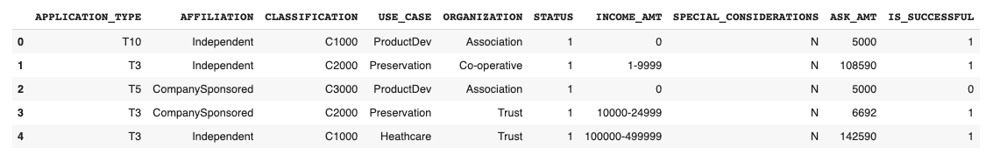
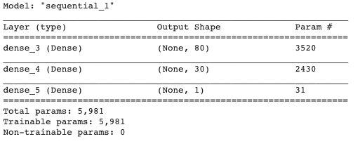
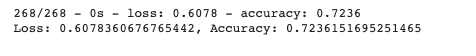
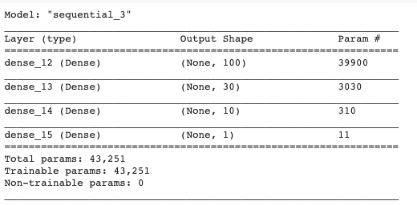
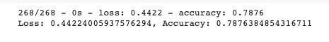
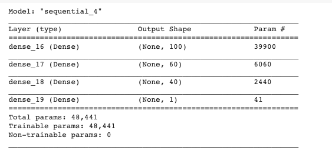
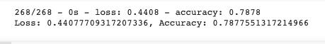

# Neural_Network_Charity_Analysis
Neural networks (also known as artificial neural networks, or ANN) are a set of algorithms that are modeled after the human brain. They are an advanced form of machine learning that recognizes patterns and features in input data and provides a clear quantitative output.
## Project Overview
The purpose of this analysis is to use a neural network to decide which companies should recieve loans from Alphabet Soup Charity Neural Network Analysis.

## Results

### Data Preprocessing
- The data was imported, analyzed, and cleaned.

## Compiling, Training, and Evaluating the Model
- first attempt a neuron network consisted of 80 neurons in the first layer and 30 in the second
- I removed the "EIN" and "NAME" column
- Both layers had relu activation functions and the output layer had a sigmoid activation function 

### Here are the preformance metrics of this model.

- In my second attempt, I removed the "EIN" column as I thought this might have been confusing the model
- For my second attempt at compiling a neuron network consisted of 100 neurons in the first layer and 30 in the second and 10 in third

### Here are the preformance metrics of this model.

- I added third layer with neurons and for my third attempt at compiling a neuron network consisted of 100 neurons in the first layer and 60 in the second and 40 in third.
- By adding a third layer, I wanted to give the model another chance to reweight the inputs from the second layer to the third.
- I also changed the activation function for the three layers to tanh. 

### Here are the preformance metrics of this model.

## Summary
I was able to create a model that could preform a 78% accuracy rating. This is potential becasue I got rid of just one columns, Next time, I would research more about activation functions to make sure that I am always choosing the right one based on the data.